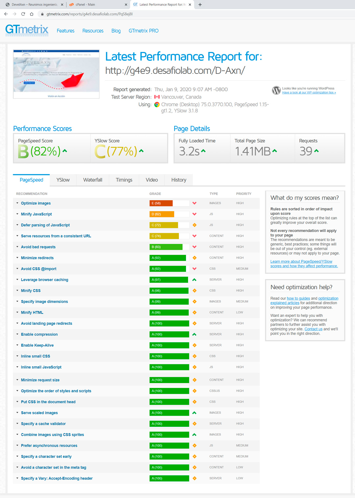
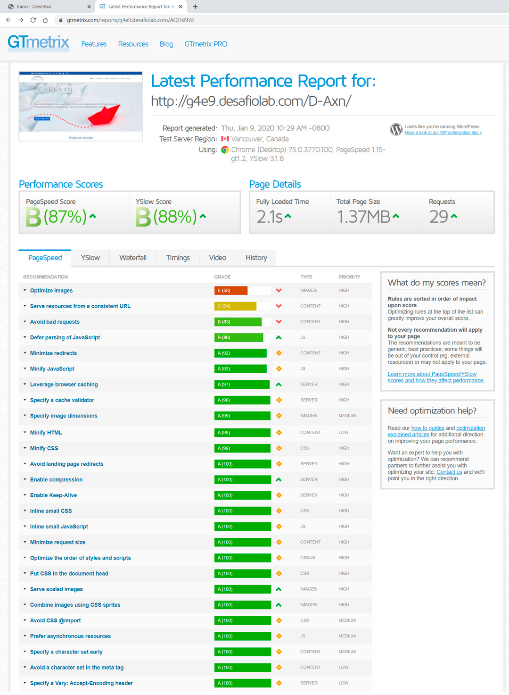
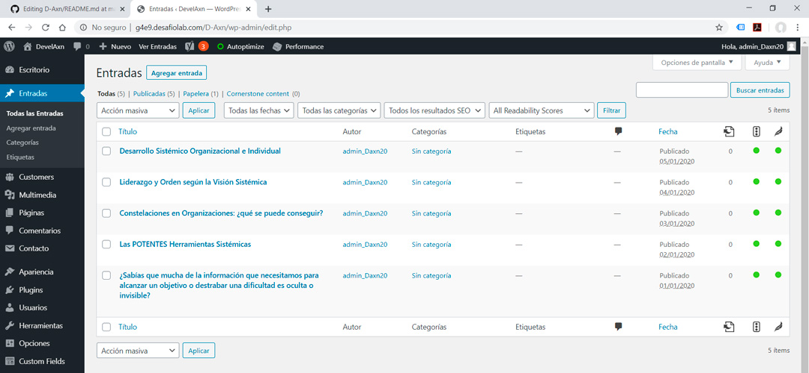
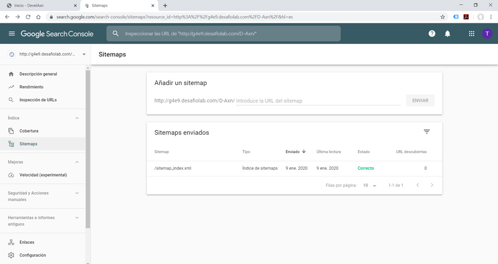

# Proyecto Final D-Axn
URL: http://g4e9.desafiolab.com/D-Axn/

### URL del sitio:
	[http://g4e9.desafiolab.com/D-Axn/](http://g4e9.desafiolab.com/D-Axn)

### Usuario y Contraseña del Sitio
	Usuario: admin_Daxn20
	Contraseña: Daxn_2020

#### Base de Datos
	Base de Datos y Usuario: daxn3
	Contraseña: daxn3_23579_@#$%&?

### Memoria del Proyecto:
- Instalación de WordPress, reemplazando carpeta wp-content por la realizada en desarrollo local
- Crear Base de Datos y Usuario
- Dejar Usuario con permisos restringidos
- Importar base de datos realizada en desarrollo local. Cambiar site URLy Home en table dl-options.
- Ejecutar instalación de WordPress
- Debug mode en wp-config
- Reducción de permisos de wp-config.php de 666 a 600
- Reemplazar .htaccess por el entregado en la plataforma
- Instalación y configuración de plugin de seguridad Wordfence

### Optimización:
- Instalación de plugin Smushit
- Instalación de plugin Autoptimize
- Instalación de plugin W3 Total Cache

### Resultado anterior a la optimización:

### Resultado posterior a la optimización:

Nota: Las imágenes sí están optimizadas, gtmetrix reclama otro formato para mayor compresión pero éste no está disponible en el plugin gratuito.

### SEO
  - Instalación plugin Yoast SEO
  - Edición de entradas según recomendaciones SEO

### URL del Sitemap
[https://g4e9.desafiolab.com/D-Axn/sitemap.xml](https://g4e9.desafiolab.com/D-Axn/sitemap.xml)

### Integración con Google Search Console:

